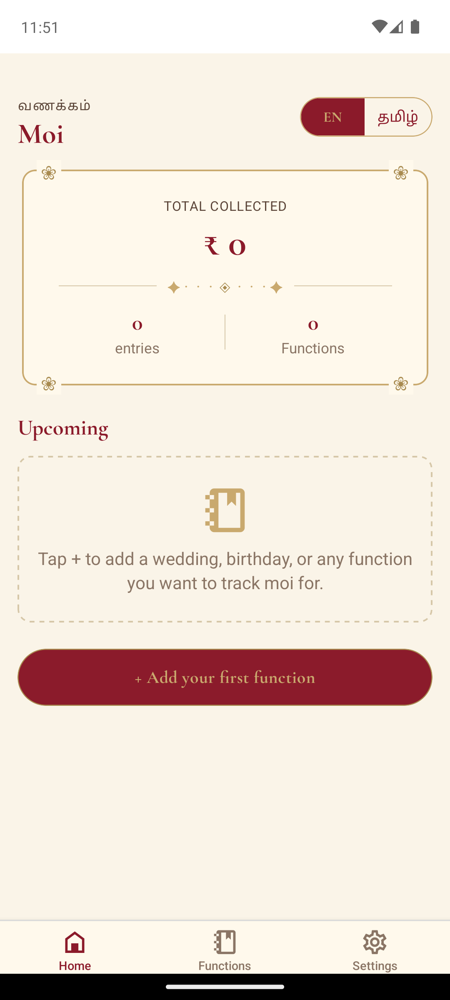
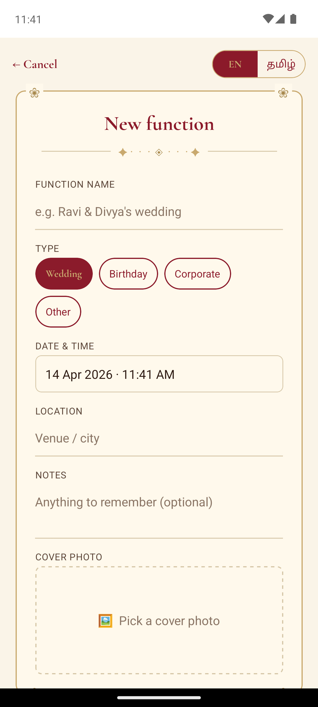

# Moi - Wedding & Function Gift Tracker

A mobile app for tracking moi (gifts) at weddings, birthdays, and functions. Think of it as a digital version of the traditional notebook used at Tamil weddings to record who gave what.

## Screenshots

<p align="center">
  
  
  
</p>

## Features

- **Create functions** - Track weddings, birthdays, corporate events, and more
- **Record moi entries** - Guest name, partner, amount, payment method (Cash/UPI), notes
- **Ledger view** - Tamil wedding themed ledger with running totals per function
- **Export** - Export moi records as CSV or styled PDF via share sheet
- **Bilingual** - Full English and Tamil (EN / தமிழ்) with one-tap language toggle
- **Offline-first** - All data stored locally on device using SQLite. No internet needed
- **Privacy** - No account, no server, no cloud. Your data stays on your phone

## Design

Tamil wedding traditional theme:
- **Palette**: Maroon `#8B1A2A` / Gold `#C9A96E` / Ivory `#FAF4E8`
- **Fonts**: Cormorant Garamond (English headings) + Anek Tamil (Tamil text) + System (English body)
- **Motifs**: Kolam-dot dividers, mango-flower frame corners, gold-bordered cards

## Tech Stack

| Layer | Technology |
|-------|-----------|
| Framework | Expo SDK 52 + React Native 0.76 |
| Routing | expo-router (file-based) |
| Storage | expo-sqlite (local, offline) |
| State | Zustand |
| i18n | i18next + react-i18next |
| Fonts | @expo-google-fonts (Cormorant Garamond, Anek Tamil) |
| Export | expo-print (PDF) + expo-sharing |

## Project Structure

```
moi-app/
  apps/
    api/         Express + MongoDB backend (archived, not used in offline mode)
    mobile/      Expo React Native app
      app/         expo-router screens
      components/  shared UI (AppText, MangoFrame, KolamDivider, MaroonButton...)
      db/          SQLite schema, migrations, CRUD helpers, export
      i18n/        en.json + ta.json translations
      store/       Zustand stores (eventsStore, giftsStore)
      theme/       Design tokens, font loader
      lib/         Utility functions
```

## Getting Started

### Prerequisites
- Node.js 20+
- pnpm 10+
- Android Studio (for emulator/build)

### Setup
```bash
git clone https://github.com/vigneshpy/moi-app.git
cd moi-app
git checkout feat/offline-sqlite
pnpm install
```

### Development (emulator)
```bash
cd apps/mobile
npx expo run:android
```

### Build Release APK
```bash
cd apps/mobile/android
JAVA_HOME=/path/to/jdk ANDROID_HOME=$HOME/Android/Sdk \
  ./gradlew :app:assembleRelease -x lint -x test
# APK at: app/build/outputs/apk/release/app-release.apk
```

### Install on Phone
Transfer the APK to your Android phone and tap to install. Enable "Install from unknown sources" if prompted.

## License

ISC
